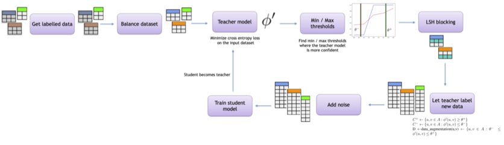
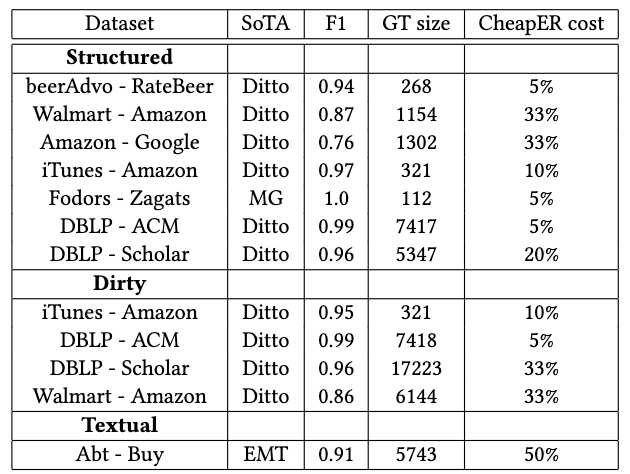

CheapER
=======

`CheapER` is a tool for performing Entity Resolution tasks with few labeled training samples.

`CheapER` adopts large language models within a _noisy training_ framework, in combination with _adaptive fine tuning_, _consistency training_, _adaptive softmax_ and _Monte Carlo dropout_.



# Experiments

`CheapER` requires less labeled training data with respect to SotA systems (as of early 2023) to reach the same _F1_.



Experiments on the _DeepMatcher_ datasets can be reproduced using the `eval.py` script.

# Notebooks

* [Effectiveness](https://colab.research.google.com/drive/1G0PMnt4xtrwvztjmOBTPbJmwV51ajysN#scrollTo=3sonS3GiFaE1) of [adaptive fine-tuning](https://ruder.io/recent-advances-lm-fine-tuning/) for the ER task.
* [CheapER training using 5% of the BeerAdvo-RateBeer dataset](example.ipynb) (using a DistilBert model).

# Citing CheapER

If you extend or use this work, please cite:

```
@article{teofili2023cheaper,
  title={CheapER: Low Cost Entity Resolution},
  author={Teofili, Tommaso and Firmani, Donatella and Merialdo, Paolo},
  year={2023}
}
```
